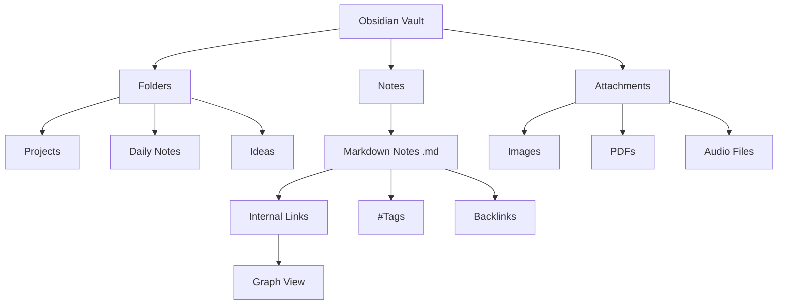

## Obsidian

Obsidian is a personal knowledge base application. It uses [[Markdown]] files and hyperlinks to keep notes interconnected. 

As you can see in this chart, there are three main objects in Obsidian: Folders, notes and attachments. Folders can contain several notes and attachments. But in the end, Obsidian is nothing but markdown files inside a folder.
## Quartz

Quartz is the bridge between a local instance of Obsidian and a responsive HTML website. It uses GitHub as a repository for all notes and HTML assets. The website is built and pushed to my domain (the website you are currently on). For more information visit the [project's official website](https://quartz.jzhao.xyz).

